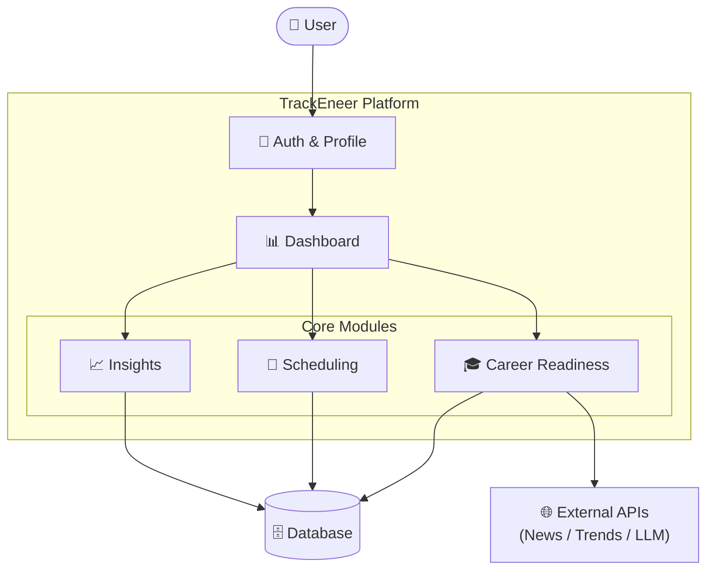
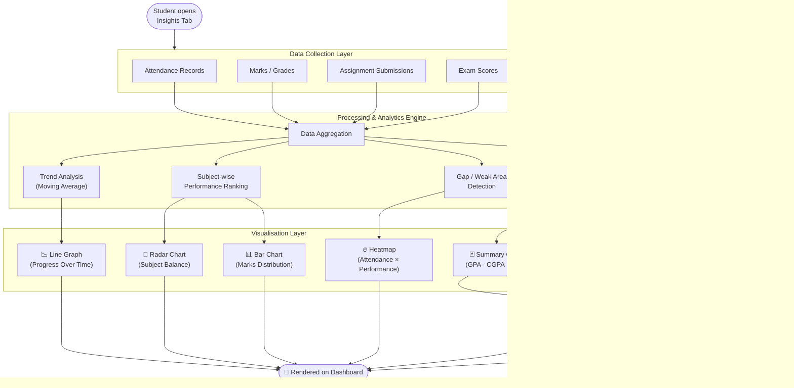
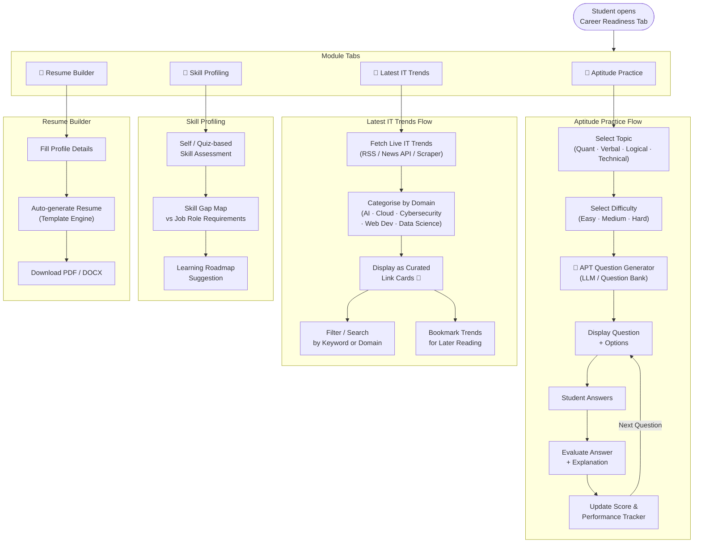
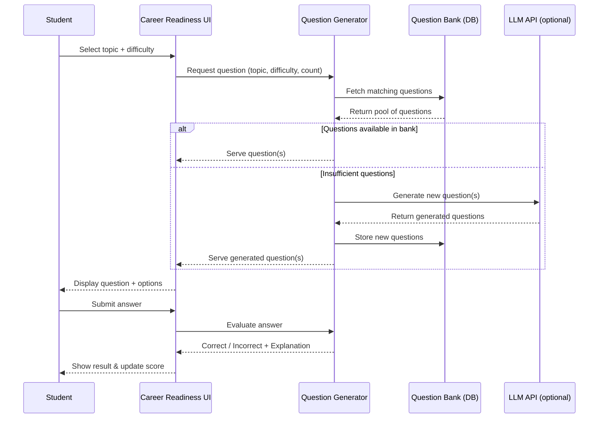
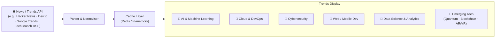
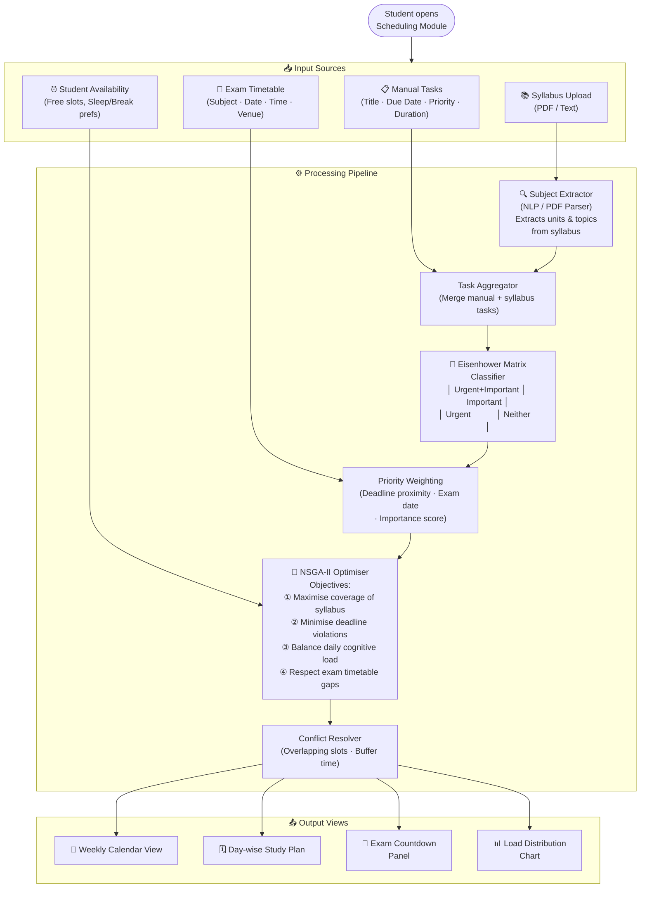
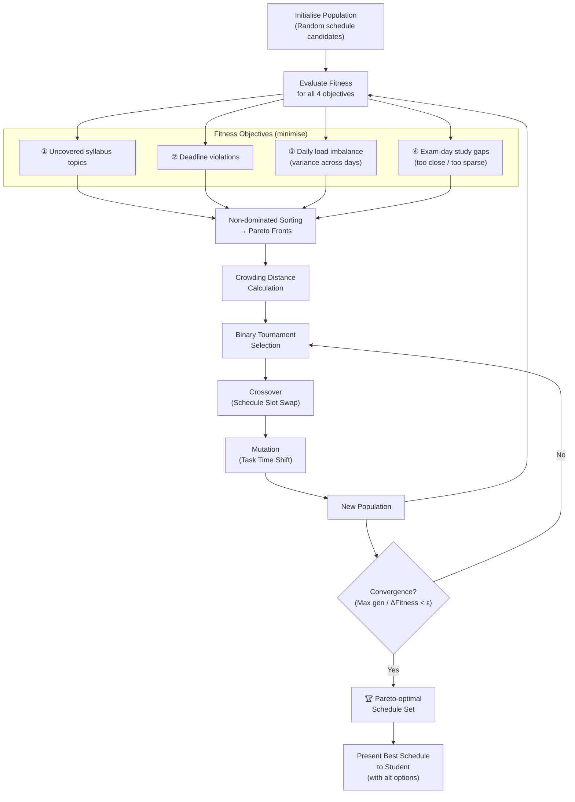
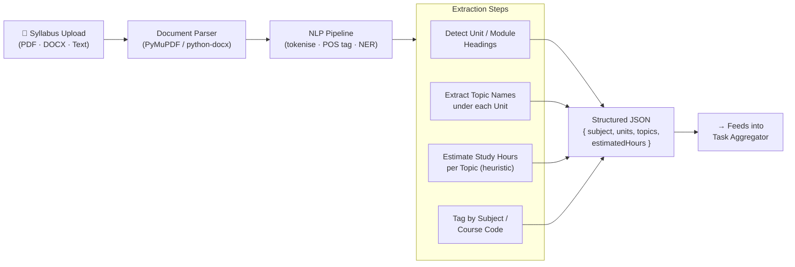
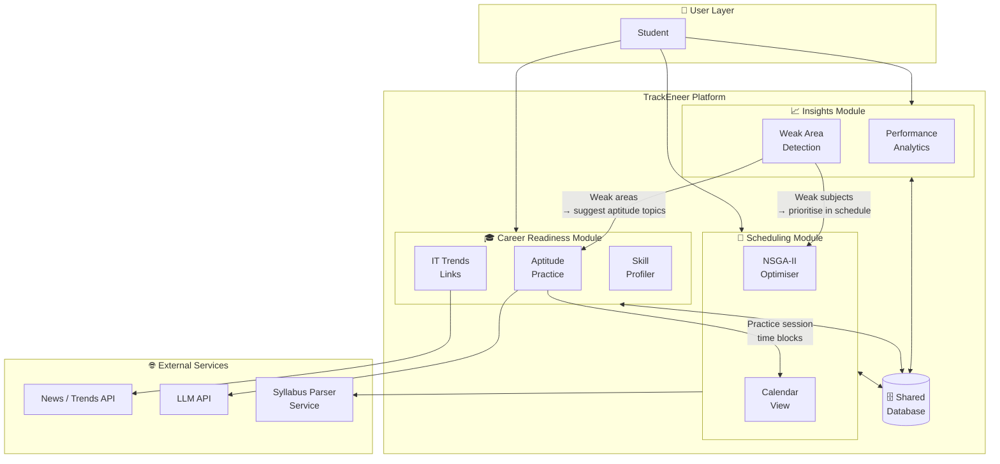

# TrackEneer — Architecture & Module Interaction Diagrams

This document captures the architecture and interaction flows for every major module of the **TrackEneer** platform, including the updated **Insights** diagram, the **Career Readiness** module, and the **Scheduling** module.

---

## Table of Contents

1. [System Overview](#1-system-overview)
2. [Insights Module](#2-insights-module)
3. [Career Readiness Module](#3-career-readiness-module)
4. [Scheduling Module](#4-scheduling-module)
5. [Module Interaction Map](#5-module-interaction-map)

---

## 1. System Overview



---

## 2. Insights Module

The Insights module aggregates academic performance data, visualises progress across subjects, and surfaces actionable analytics to the student.



### Key Insight Metrics

| Metric | Source | Visualisation |
|---|---|---|
| Subject-wise GPA | Marks records | Radar chart |
| Attendance rate | Attendance records | Heatmap |
| Score trend | Historical exam scores | Line graph |
| Rank (batch/class) | Aggregated marks | Summary card |
| Weak areas | Gap detection engine | Alert cards |
| Predicted final score | ML estimation model | Goal tracker |

---

## 3. Career Readiness Module

The Career Readiness module prepares students for placements by offering aptitude practice, skill assessment, and live IT trend monitoring.



### APT Question Generator — Detail



### Latest IT Trends Tab — Link Card Format



> **Each link card contains:** Article title · Source name · Published date · Direct URL · Domain tag

---

## 4. Scheduling Module

The Scheduling module creates an optimised personal study schedule by combining user-defined tasks, syllabus subjects, exam timetable, and the Eisenhower priority matrix, solved via **NSGA-II** multi-objective optimisation.



### Eisenhower Matrix Classification

```mermaid
quadrantChart
    title Eisenhower Matrix — Task Prioritisation
    x-axis Low Urgency --> High Urgency
    y-axis Low Importance --> High Importance
    quadrant-1 Do First (Schedule immediately)
    quadrant-2 Schedule (Plan for later)
    quadrant-3 Delegate / Minimise
    quadrant-4 Eliminate
    Exam Revision: [0.85, 0.9]
    Assignment Due Today: [0.9, 0.75]
    Project Research: [0.4, 0.8]
    Skill Building: [0.35, 0.7]
    Emails & Admin: [0.7, 0.35]
    Social Media: [0.6, 0.2]
    Elective Reading: [0.2, 0.45]
    Low-priority Tasks: [0.25, 0.25]
```

### NSGA-II Multi-Objective Optimisation Flow



### Syllabus Subject Extractor — Detail



---

## 5. Module Interaction Map

Shows how the three core modules share data and interact at runtime.



---

*Last updated: April 2026 — TrackEneer Architecture Team*
